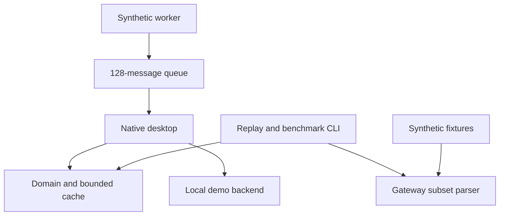

# Architecture

## Current executable boundaries

Current code has no network access. The parser and timing helpers are independent building blocks, not a complete Discord adapter. Unknown Gateway dispatches retain sequence information; full READY/RESUMED, reconnect close-code handling, compression, session limits and retries remain backlog work.

## Intended production design

| Boundary | Responsibility | Rules |
| --- | --- | --- |
| Native UI | Virtualized variable-height timeline, focus, selection, accessibility | No disk, HTTP, decode, or blocking locks on UI thread |
| Domain reducer | Normalized IDs, permissions, unread state, delivery lifecycle | Single writer; stable IDs; explicit failure events |
| Adapter actor | Account/session capability map and event translation | Supported endpoints only for chosen mode; explicit unsupported states |
| REST scheduler | Reuse connections, major-resource bucket keys, global/per-bucket limits | Honor server retry information; bounded in-flight work; no blind retry of POSTs |
| Gateway task | Decode, sequence, heartbeat, reconnect/resume | Monotonic time; cancellation; capped compressed and decompressed data |
| Storage worker | SQLite WAL, schema migration, bounded history/cache | Disk quota, retention, deletion/permission invalidation; batching |
| Media workers | Thumbnail decode, downloads, upload staging | Byte/pixel caps, cancellation, no arbitrary URL fetching backend |
| Audio subsystem | WASAPI/CPAL, buffers, Opus, device changes, encryption | Real-time thread never allocates or blocks; control work elsewhere |
| OS services | Credentials, toasts, tray, hotkeys, updates | Platform interface; DPAPI/Credential Manager on Windows; no bundled secret |

Use Tokio for future network and storage orchestration. It is intentionally not a dependency until an async adapter exists. The synchronous `Backend` trait is the demo seam; replace it with typed bounded command/event channels when introducing the actor. Keep authentication identity and capability decisions out of the rendering layer.

## Budgets and backpressure

The M0 cache caps entries and text bytes globally across channels, avoids duplicate keys and evicts FIFO. It is not an LRU cache and is not durable. The UI caches filtered key lists, recomputes them on relevant changes, and draws only visible compact rows. Fixed-height previews are a prototype compromise; the detail panel shows full text.

When a future gateway event queue fills, never silently drop authoritative message or permission events. Trigger reconciliation/resume or explicit disconnect. Presence and typing may be coalesced by entity with expiry. Outgoing messages require IDs/nonces and an acknowledged delivery model to avoid duplicating writes after network failures. Do not borrow the demo echo semantics for a live adapter.

## Security and privacy implementation boundaries

Do not log authorization headers, cookies, raw frames, content, or signed CDN query strings. Credentials are absent in M0. Future OAuth uses system-browser authorization, state/PKCE where supported, and OS storage; flows requiring a confidential secret must not ship that secret inside a desktop binary. Threat-model renderer inputs, attachment decompression, deep links, credential lifecycle, updates and dependency supply chains before M1.

## Portability

Initial distribution target: `x86_64-pc-windows-msvc`. Keep Win32 in a later `platform-windows` crate. Core/protocol tests run on Windows, Linux and macOS in CI. Native desktop validation begins on Windows, then arm64 Windows, macOS arm64, and Linux x64. Cross-compilation is not evidence of runtime behavior on a target OS.
